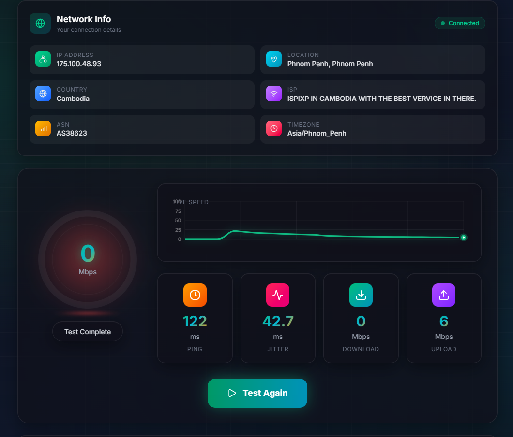

# FiberTest - Premium Internet Speed Test

[](https://nextjs.org/)
[](https://www.typescriptlang.org/)
[](LICENSE)
[](https://tailwindcss.com/)

A lightweight, free and open-source **internet speed test** web application built with Next.js. Test your **download speed**, **upload speed**, **ping**, and **jitter** with a premium glassmorphism UI - completely free, no registration required.

> **Professional Grade** - Measure your network bandwidth with precision in a sleek, modern interface



## Features

- ⚡ **Download Speed Test** - Measure your download bandwidth in Mbps
- 📤 **Upload Speed Test** - Measure your upload bandwidth in Mbps
- 🏓 **Ping Test** - Check your network latency in milliseconds
- 📊 **Jitter Test** - Measure connection stability
- 🌐 **Enhanced ISP Detection** - IP, Location, Country, ISP, ASN, Timezone
- 📈 **Real-time Speed Graph** - Live canvas visualization during tests
- 🎯 **Performance Rating** - Excellent/Very Good/Good/Fair based on results
- 📱 **Mobile Responsive** - Works on desktop and mobile devices
- ✨ **Premium Glassmorphism UI** - Modern dark theme with blur effects
- 🎬 **Animated Visuals** - Floating particles, pulsing rings, smooth transitions
- 🔒 **Privacy First** - No data collection, no registration

## Live Demo

**[FiberTest Demo](https://fiber-test-ivory.vercel.app/)** - Test your connection now!

## Quick Start

```bash
# Clone the repository
git clone https://github.com/henglyrepo/FiberTest.git
cd FiberTest

# Install dependencies
npm install

# Start development server
npm run dev
```

Open [http://localhost:3000](http://localhost:3000) in your browser to run a speed test.

## Production Build

```bash
# Build for production
npm run build

# Start production server
npm run start
```

## How It Works

FiberTest measures your internet connection speed using the following methods:

1. **Ping Test**: Sends multiple HTTP HEAD requests to measure latency
2. **Download Test**: Downloads data from multiple CDN endpoints simultaneously to measure bandwidth
3. **Upload Test**: Uploads random data to measure upload throughput
4. **Jitter Calculation**: Analyzes ping variations to determine connection stability
5. **Real-time Graph**: Visualizes speed changes during the test with live updates

## Tech Stack

- **Framework**: [Next.js 16](https://nextjs.org/) - React framework for production
- **Language**: [TypeScript](https://www.typescriptlang.org/) - Type-safe JavaScript
- **Styling**: [TailwindCSS 4](https://tailwindcss.com/) - Utility-first CSS framework
- **Icons**: [Lucide React](https://lucide.dev/) - Beautiful icons

## API Endpoints Used

| Service | Purpose | URL |
|---------|---------|-----|
| Cloudflare | Download speed test | speed.cloudflare.com |
| Hetzner | Alternative download | speed.hetzner.de |
| OVH | Alternative download | proof.ovh.net |
| ipapi.co | IP & ISP detection | ipapi.co/json |

## Project Structure

```
FiberTest/
├── src/
│   ├── app/
│   │   ├── page.tsx          # Main speed test page
│   │   ├── layout.tsx        # Root layout
│   │   └── globals.css       # Global styles & animations
│   ├── components/
│   │   ├── SpeedGauge.tsx   # Animated 3D speed gauge
│   │   ├── SpeedGraph.tsx   # Real-time speed graph
│   │   └── ServerInfo.tsx   # Network information display
│   └── hooks/
│       └── useSpeedTest.ts  # Speed test logic
├── public/
│   └── image.png            # UI screenshot
├── next.config.ts           # Next.js configuration
├── tailwind.config.ts       # Tailwind configuration
├── tsconfig.json            # TypeScript configuration
└── package.json             # Dependencies
```

## Deployment to Vercel

The easiest way to deploy FiberTest is using [Vercel](https://vercel.com):

1. Fork or clone this repository
2. Go to [Vercel](https://vercel.com) and sign in
3. Click "Add New..." → "Project"
4. Import your GitHub repository
5. Vercel will auto-detect Next.js settings
6. Click "Deploy"

That's it! Your speed test will be live in minutes.

## Configuration

### Adding Custom CDN Endpoints

Edit `src/hooks/useSpeedTest.ts` to add custom test servers:

```typescript
const CDN_ENDPOINTS = [
  "https://your-cdn.com/__down?bytes=10000000",
  // Add more endpoints...
];
```

### Adding Custom Upload Endpoints

```typescript
const UPLOAD_ENDPOINTS = [
  "https://your-upload-server.com/upload",
  // Add more endpoints...
];
```

## Browser Support

| Browser | Version | Support |
|---------|---------|---------|
| Chrome | 90+ | ✅ Full |
| Firefox | 88+ | ✅ Full |
| Safari | 14+ | ✅ Full |
| Edge | 90+ | ✅ Full |

## Contributing

Contributions are welcome! Please feel free to submit a Pull Request.

1. Fork the repository
2. Create your feature branch (`git checkout -b feature/amazing-feature`)
3. Commit your changes (`git commit -m 'Add some amazing feature'`)
4. Push to the branch (`git push origin feature/amazing-feature`)
5. Open a Pull Request

## License

This project is licensed under the **MIT License** - see the [LICENSE](LICENSE) file for details.

## Acknowledgments

- [OpenSpeedTest](https://openspeedtest.com/) - Inspiration for speed test implementation
- [LibreSpeed](https://librespeed.org/) - Open source speed test project
- [Cloudflare](https://www.cloudflare.com/) - CDN for speed testing
- [Next.js Team](https://nextjs.org/) - Amazing framework

## Related Projects

- [OpenSpeedTest](https://github.com/openspeedtest/Speed-Test) - Free & Open-Source HTML5 Speed Test
- [LibreSpeed](https://github.com/librespeed/speedtest) - Self-hosted Speed Test
- [speedtest-cli](https://github.com/sivel/speedtest-cli) - Command line speed test

## Keywords

internet speed test, speed test, download speed, upload speed, bandwidth test, network speed test, ping test, latency, jitter, Mbps, free speed test, open source speed test, HTML5 speed test, self-hosted speed test, Next.js speed test, React speed test, glassmorphism UI, premium speed test

---

<div align="center">

**⭐ Star this repo if you found it useful!**

Built with ❤️ using Next.js

</div>
